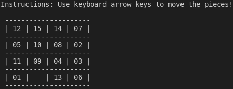

# 15 Puzzle

## Overview

15 Puzzle game developed in C. It posseses the following characteristics:

- Developed with C99;
- The [15 Puzzle](https://en.wikipedia.org/wiki/15_puzzle) is a puzzle with the following characteristics:
    - It is a sliding puzzle having 15 square pieces numbered 1–15 in a frame that is 4 pieces high and 4 pieces wide, leaving one unoccupied piece position;
    - pieces in the same row or column of the open position can be moved by sliding them horizontally or vertically, respectively;
    - The goal of the puzzle is to place the pieces in numerical order;
- It is an terminal interactive application, and its visual is just like this:



## Usage

Download this project and compile it by typing the command `make` in its folder. Next, just run the executable:

```
./15puzzle
```

The remaining instructions will be passed by the executable itself. You may use the keyboard arrow keys to move the pieces.